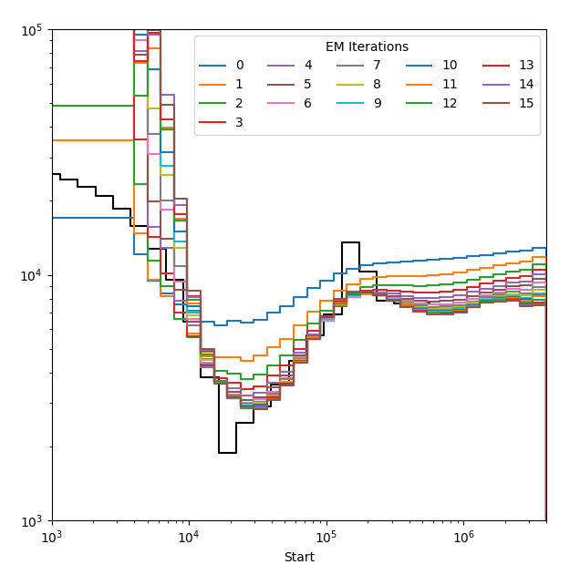

.. _getting_started:

Getting Started
===============

This guide will familiarise your with the concepts necessary to run analyses in SMCSMC and take you through the basic aspects of an analysis using  toy data. You may also be interested in one of several examples using real and simulated data in the :ref:`tutorial` section.

.. note::
        This tutorial is intended to be run on a personal computer, and values have been scaled accordingly. For analysis on real data, we expect that a user will have access to a compute cluster, and we provide guidance about setting up :code:`smcsmc` to function with common architechtures in :ref:`cluster`.  

Basic Concepts
--------------

SMCSMC is a :term:`particle filter<Particle Filter>`, which means that a given number of :term:`particles<Particle>` are simulated, evaluated for an approximate likelihood, and resampled until demographic parameters have converged. Many of the options relate to the behaviour of this particle filter, and the remainder deal with the demographic model that you wish to infer. SMCSMC can infer complex demographic models involving several populations, though you should be weary of overspecifying your model. Run time increases drastically with the number of parameters needed to specify the model.   

Input Format
++++++++++++++

Suppose we have the following data, saved into a file named :code:`toy.seg`. You can also download it `here <https://github.com/luntergroup/smcsmc/tree/devel/docs/files/toy.seg>`_.

.. csv-table::
   :header: segment start, segment length, invariant, break, chr, genotype
   :widths: 5, 5, 2, 2, 2, 5

    1,       521,     T,       F,       1,       01\.0
    522,     2721,    T,       F,       1,       0111
    3243,    1758,    T,       F,       1,       10\/\/
    5001,    1296,    T,       F,       1,       0000
    6297,    1,       T,       F,       1,       \.\.\.\.
    6298,    4669,    T,       F,       1,       0110
    10967,   880,     T,       T,       1,       0100
    1,       708,     T,       F,       2,       1010

This gives the state of four haplotypes along the sequence, indicating segment starts and their lengths. If a segment is the last in a block before coordinates reset (i.e. when including multiple chromosomes in a single :code:`seg` file, it is called a genetic break. Genotypes in terms of either major/minor or ancestral/derived are given for each haplotype. Missing data is coded with a period (:code:`.`) whilst unphased heterozygous variants are encoded as two forward slashes (:code:`/`). 

.. note::
        This data format is similar to the input for `msmc <https://github.com/stschiff/msmc>`_ however, in the second column we require the length from the current segment to the next, rather than the number of called sites from the previous segment to the current one. 

Segment files are specified by the :code:`seg` flag, or if more than one are used, by the :code:`segs` flag. Globs are encouraged for readability. In the case of multiple files, genetic breaks are inferred from the beginnings and ends of files. Additionally, we tell :code:`smcsmc` the number of samples we expect with :code:`nsam`, so it knows to check the :code:`seg` file for formatting issues.

Basic Arguments
++++++++++++++++++

In addition to the segment file, we need a few more pieces of information to kick off the particle filter.

**Particle Count:** We must specify a particle count (:code:`Np`) or use the default value of 1000. The number of particles refers to the number of individual ARGs which are simulated by :code:`SCRM`, higher numbers means that the model is more likely to converge on a reasonable answer, but increasing the particle count is computationally expensive. We recommend particle counts between 10000 and 50000 for analysis. However, for exploratory work, smaller particle counts (a good starting point is 10 thousand) can be used to more effectively use computational resources.  In this guide, intended for use on a personal computer, we will use 10 particles.

**Number of Iterations:** We also explictly define the number of expectation maximization iterations that we want to use (:code:`EM`). A good place to start is 15 iterations. :code:`smcsmc` looks for output before starting, so should you be unsatisfied with the convergence after 15 iterations, simply run the exact same program with a higher number of iterations. :code:`smcsmc` will find the output for the iterations already run and continue from where it left off. 

**Demographic Parameters:** Several arguments are good to specify, especially when analysing real data as they help with convergence. Here we will use a mutation rate (:code:`mu`) of :code:`1.25e-8` and a recombination rate (:code:`rho`) of :code:`3e-9`.  These rates are given in units of events per generation.  We use an effective population size (:code:`N0`) of 10000, and infer trees back to :code:`4*N0` generations with :code:`tmax`, set by default to 3.5 (corresponding to 140k generations, or 1.2 Mya assuming a generation time of 25 years). :code:`smcsmc` infers demographic parameters as discrete over intervals. We specify 31 intervals evenly spaced on the log scale with :code:`P 133 133032 31*1` giving the end times of the first and last epochs in generations, and the pattern for their generation. 

We also give the path to the output folder with :code:`o`.

Running :code:`smcsmc`
------------------------

.. tip:: 
        It is always a good idea to start a new :code:`conda` environment for a new analysis to ensure that there are no dependecy conflicts, though you can skip this step if you certain that your environment is correctly configured.

        .. code-block:: bash

                conda create --name smcsmc_tutorial
                conda activate smcsmc_tutorial

Once :code:`smcsmc` is installed, we can format the arguments detailed above into a dictionary. 

.. code-block:: python

   import os

   args = {
      'seg':                  'toy.seg',
      'nsam':                 '4',
      'Np':                   '10',
      'EM':                   '1',
      'mu':                   '1.25e-8',
      'rho':                  '3e-9',
      'N0':                   '10000',
      'tmax':                 '3.5',
      'P':                    '133 133032 31*1',
      'no_infer_recomb':      '',
      'smcsmcpath':           os.path.expandvars('${CONDA_PREFIX}/bin/smcsmc'),
      # The minimum segment length is usually best left
      # as the default, however for this tutorial we set it 
      # artifically low.
      'minseg':               '10', 
      'o':                    'smcsmc_output'
   }

We directly use this dictionary with the :code:`run_smcsmc` command, which takes as its only argument a dictionary of arguments.

.. code-block:: python

        import smcsmc
        smcsmc.run_smcsmc(args)

If your installation has been successful, then this will begin the process of parsing the input, merging any given :code:`seg` files, starting the particle filter, and iterating through the :code:`EM` steps requested.

Output
------

If your :code:`smcsmc` has run correctly, the resulting output directory will look something like this, with a seperate folder for each EM iteration, and a seperate file for each chunk, if this option has been used.

.. code-block:: bash
        
        output/
                emiterN/
                        chunkN.out
                        chunkN.stdout
                        chunkN.stderr
                        chunkfinal.out
                merged.seg
                merged.map
                result.log
                result.out

If you are following this tutorial and are only using a single input :code:`seg` file, you will not see :code:`merged.seg` or :code:`merged.map` as there was no need to generate them. The output for each chunk is given, along with stdout and sterr, and results are aggregated over all chunks in :code:`chunkfinal.out`. The final epoch will be post processed into :code:`result.out`. Output and debugging information along with useful information to help interpret the results of your model are given in :code:`result.log`.

An example of a `results.out` file is given here:

.. code-block:: bash

        Iter  Epoch       Start       End   Type   From     To            Opp          Count           Rate             Ne         ESS  Clump
        15      0           0         133   Coal      0     -1      307466.77      18.798649  6.1140424e-05      8177.8955      1.0272     -1
        15      0           0         133   Coal      1     -1      324087.66      55.469939  0.00017115721      2921.2909      1.0225     -1
        15      1         133       166.2   Coal      0     -1       167571.8      1.0002328  5.9689802e-06      83766.402      1.0791     -1
        15      1         133       166.2   Coal      1     -1      174231.23    0.067992116  3.9024069e-07      1281260.5      1.0674     -1
        15      2       166.2      207.68   Coal      0     -1      259801.05      40.479172  0.00015580835      3209.0707      1.1686     -1
        15      2       166.2      207.68   Coal      1     -1      267803.96  0.00028150086  1.0511452e-09  4.7567166e+08      1.1522     -1
        15     -1           0       1e+99  Delay     -1     -1  2.6001037e+09              0              0              0           1     -1
        15     -1           0       1e+99   LogL     -1     -1              1      -31005174      -31005174              0           1     -1
        15      0           0         133   Migr      0      1       178112.7      7.1251662  4.0003695e-05              0      1.0385     -1
        15      0           0         133   Migr      1      0      186343.02  0.00022362676  1.2000812e-09              0      1.0338     -1
        15      1         133       166.2   Migr      0      1       87712.37      0.5934193  6.7655144e-06              0      1.0819     -1
        15      1         133       166.2   Migr      1      0       91253.03      3.0913275  3.3876437e-05              0      1.0713     -1
        15      2       166.2      207.68   Migr      0      1      134755.98      1.0135379  7.5212833e-06              0      1.1711     -1
        15      2       166.2      207.68   Migr      1      0      139267.34      6.0189739  4.3218847e-05              0      1.1565     -1

The values in the columns have the following meaning:

* **Iter**: The EM iteration to which this file refers. In the case of aggregated files (:code:`chunkfinal.out`, :code:`result.out`), multiple iterations are represented in the same file, and it is often useful either to graph each iteration seperately to show convergence, or to select the last iteration to show the final inference.
* **Epoch**: The time interval this row refers to. Rates are assumed to be constant in each epoch.  Epoch boundaries are set by the :code:`P` flag. 
* **Start**: The beginning of the epoch, in generations (backwards in time). 
* **End**: The end of the epoch, in generations.
* **Type**: Either :code:`Coal` (coalescence), :code:`Migr` (migration), :code:`Delay` or :code:`LogL`. The important lines are:

  * :code:`Coal`: This line refers to coalescent events. The :code:`From` field refers to the population deme in which coalescences occur; :code:`To` has no meaning.  For convenience the :code:`Ne` columns provides an estimate of the effective population size, equal to 1 over twice the estimated coalescent rate.
  * :code:`Migr`: This line refers to migration events. :code:`From` and :code:`To` refer to the source and the sink of migration, **backwards** in time. 

* **Opp**: The opportunity for events of this type to have happened: the total time (in generations), or for recombinations, the amount of time times number of nucleotides. 
* **Count**: The number of events of this type inferred in this epoch. 
* **Rate**: Either the coalescent, recombination, or migration rate. This is equal to the :code:`Count` divided by :code:`Opp`. Coalescent rates are number of coalescennt events per generation. Migration rates represent proportion migration from the source (:code:`From`) to the sink (:code:`To`) **backwards in time**.

.. note::

        :code:`SCRM` reports migration rates **forwards in time** while :code:`smcsmc` reports it **backwards in time**.

* **Ne**: The estimated population size in this epoch. Defined to be :code:`Opp` divded by :code:`2*Count`.
* **ESS**: Effective sample size, which is an indicator of particle diversity.
* **Clump**: This is defined in intermediary files, not in aggregated output.

Very low counts in a particular epoch may indicate a truly low or zero rate, but may also be a result of undersampling.  Try increasing the number of particles, or increasing the epoch sizes.

Visualising Output
------------------

We provide several functions for visualising different aspects of the output. 

It is a good idea to first check the convergence of your model by plotting each iteration seperately in what we refer to as a rainbow plot. Specify the path to your output :code:`result.out` file and the path to a preferred file path to store the image.

.. code-block:: python

        result_path = 'output/result.out'
        plot_path = 'output/rainbow.png'

        smcsmc.plot_migration(result_path, plot_path)

An example plot is shown below, note that we have additionally specified a model from which this data was simulated. For details, please refer to the tutorials. 

   Estimated population size over 15 EM iterations, where each iteration is plotted in a different colour.

Plotting migration and effective population size can be done similarly with :code:`smcsmc.plot_migration` and `smcsmc.plot_ne`. See the API documentation for more information. 

.. toctree:: 
    :maxdepth: 1
    :caption: Other guides in this section

    cluster
