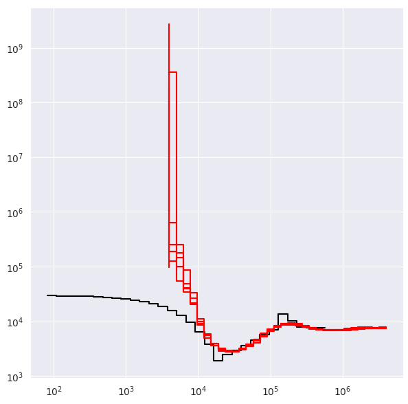

Introduction
============

SMCSMC, short for :term:`Sequential Monte Carlo<Particle Filter>` for the :term:`Sequentially Markovian Coalescent`, is a method for estimating ancestral population size and migration history from sequence data. It has several advantages over comparable methods, especially when you are interested in analysing complex demographic models. 

The method uses a :term:`particle filter<Particle Filter>` to sample from the posterior distribution of trees along the sequence and :term:`Variational Bayes` to infer epoch specific :term:`demographic parameters<Demographic Parameters>` over a given number of iterations. 

:code:`smcsmc` takes as input optionally phased sequencing data formatted as segments, and provides utilities for analysing and visualising the inferred ancestral rates.

Installation
-----------

We *highly* recommend installing SMCSMC from :code:`conda`, as it comes packaged with all necessary dependencies. A seperate guide for manual compilation may be found `in the developer reference <https::github.com>`_\ .  `See here <https://docs.conda.io/projects/conda/en/latest/user-guide/getting-started.html>`_ for a helpful guide to installing and using :code:`conda` to manage programs. 

To install from :code:`conda` you must add both the :code:`luntergroup` and :code:`conda-forge` channels. The first contains :code:`smcsmc`, while the second is required for a more recent version of Boost.

.. code-block:: bash

   conda install -c conda-forge -c luntergroup smcsmc

Basic Usage
----------

:code:`smcsmc` can be run on the command line with :code:`smc2` or through the python API.

.. code-block:: sh

        smc2 -h

Follow the :ref:`getting_started` guide to become familiar with the basic structure and function of SMCSMC commands, then look at one of the tutorials for analysing simulated or real data. For a more complete guide to arguments, see :ref:`args`. 

Other Methods
------------

SMCSMC is part of the `PopSim consortium <https://github.com/popgensims>`_\ , and we are actively involved in building a framework to standardize population genetic analyses. Part of this involves making it easy to run the same analysis with many different methods. We have built :code:`smcsmc` with this goal in mind. For the latest information about comparisons between different population genetic software, including :code:`smc++`, :code:`stairwayplot`, :code:`msmc`, and :code:`dadi/fastcoal`, check out the `PopSim analysis repository <https://github.com/popgensims/analysis>`_\ .

   
   Population history of a European-acting individual inferred from five replicates of the :code:`stdpopsim.homo_sapiens.GutenkunstThreePopOutOfAfrica` model of human history.

Citation
--------

If you use :code:`smcsmc` in your work, please cite the following article:

        1. Henderson, D., Zhu, S. (Joe), & Lunter, G. (2018). Demographic inference using particle filters for continuous Markov jump processes. BioRxiv, 382218. https://doi.org/10.1101/382218
        2. Staab, P. R., Zhu, S., Metzler, D., & Lunter, G. (2015). scrm: efficiently simulating long sequences using the approximated coalescent with recombination. Bioinformatics, 31(10), 1680–1682. https://doi.org/10.1093/bioinformatics/btu861 

